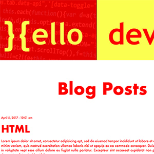

# Code that may be used in the future

****
```html
<div class="thumb-1">
  <a href="https://joshin-run.github.io/blueboat/" target="_blank"></a>
</div>
<div class="thumb-3">
  <a href="https://joshin-run.github.io/hello-dev-blog" target="_blank"></a>
</div>
<div class="thumb-5">
  <a href="https://joshin-run.github.io/countdown-clock/" target="_blank"></a>
</div>
<div class="thumb-6">
  <a href=" https://joshin-run.github.io/edison-tribute/" target="_blank"></a>
</div>
<div class="thumb-7">
  <a href="https://joshin-run.github.io/hangman-game/" target="_blank"></a>
</div>
```
